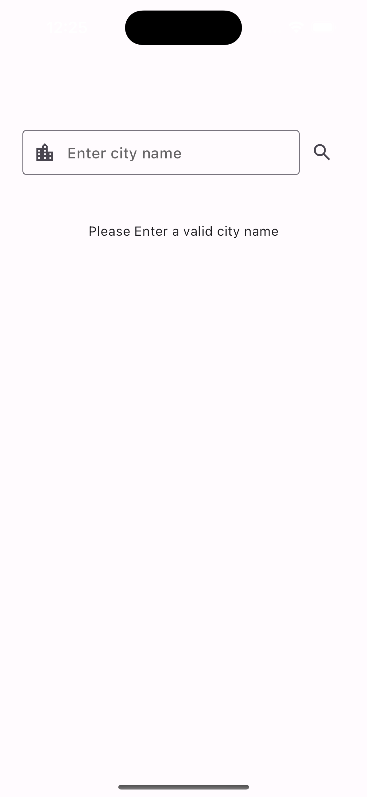
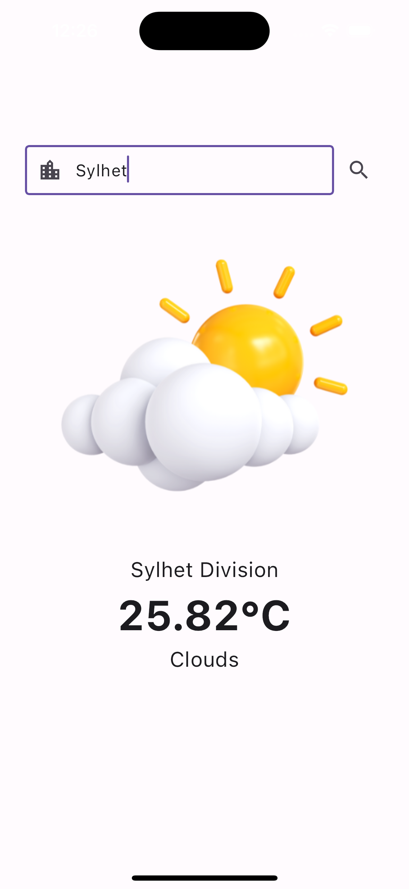

# Quick Weather App

<p float="left">
     
     
</p>

## How to run this project? 

After Cloning the project run the following commands:
```sh
# Get Packages
flutter pub get

# generate files
dart run build_runner build --delete-conflicting-outputs
```

This project contains 3 flavors:

- development
- staging
- production

To run the desired flavor either use the launch configuration in VSCode/Android Studio or use the following commands:

```sh
# Development
$ flutter run --flavor development --target lib/main_development.dart --dart-define API_KEY=d719864e996c31de59da5d5bb5aad7ce

# Staging
$ flutter run --flavor staging --target lib/main_staging.dart --dart-define API_KEY=d719864e996c31de59da5d5bb5aad7ce

# Production
$ flutter run --flavor production --target lib/main_production.dart --dart-define API_KEY=d719864e996c31de59da5d5bb5aad7ce
```

### Api Key

**To run the app, you must provide an API_KEY through additional command arguments; otherwise, an ApiKeyNotFound exception will be thrown. For demonstration purposes, the key is provided here along with instructions on how to run the app with the API key. However, to keep the API key secure, we do not include it directly in the client project.**


# Project Structure

## What is clean architecture?
<a href="https://blog.cleancoder.com/uncle-bob/2012/08/13/the-clean-architecture.html"> Clean Architecture </a>, conceptualized by Robert C. Martin, offers a structured approach to organizing applications by breaking them down into modules, each serving a distinct purpose. Its core principle revolves around dividing an application into three primary layers:

**Presentation Layer:** This layer's primary role is to present data to users and manage their input. It should remain devoid of any business logic and maintain simplicity as a fundamental principle.

**Domain Layer:** The domain layer is the hub of business logic within the application. It defines use cases and entities the essence of the application's functionality. Importantly, it operates independently of other layers, facilitating isolated testing.

**Data Layer:** Responsible for data operations, this layer handles data retrieval and storage. It remains detached from the domain layer, focusing solely on data access and persistence concerns.

Clean Architecture's central tenet is preserving these well-defined layers to enhance application maintainability, scalability, and testability, while also enabling smoother code evolution.
<p float="left">
  
</p>


The concentric circles within the image represent the different areas within the software. The closer to the center, the higher level the software becomes. Notice how the horizontal arrows only point inwards, this is because the sole principle behind Clean Architecture is known as the Dependency Rule.

This means that code dependencies can only point inwards, as indicated by the arrows. A presenter within the interface adapter layer can't depend on any mechanisms within the drivers layer. However, a use case within the application business layer can depend on an entity within the enterprise business layer, and so on. The dependencies always point inwards.

The four circles illustrated in the diagram are schematic. There is no rule that states you should only have 4 layers within your software, you have have more, or less, but the main principle of the dependency rule still applies overall.

## Benefits of implementing Clean Architecture

**Modularity and Maintainability:** Clean Architecture encourages the separation of concerns into distinct layers. This makes your codebase more modular and easier to maintain. Developers can work on individual layers without affecting others, reducing the risk of unintended side effects.

**Testability:** The separation of the domain layer from the rest of the application allows for comprehensive unit testing of business logic. This ensures that your app behaves as expected, and changes can be validated through tests, reducing the chances of introducing bugs.

**Flexibility and Scalability:** Clean Architecture makes it easier to adapt and scale your app. You can replace or upgrade components within a layer without affecting the entire system. This flexibility is crucial as your app evolves and new features are added.

**Code Reusability:** Clean Architecture promotes the reuse of components. For instance, the domain layer, which contains the core business logic, can be reused across different platforms (e.g., web and mobile) if needed.

**Separation of Concerns:** The architecture enforces a clear separation between the user interface (presentation layer), business logic (domain layer), and data handling (data layer). This separation helps in understanding and maintaining the codebase.

**Reduced Dependency Hell:** Clean Architecture discourages high-level layers from having direct dependencies on lower-level layers. This minimizes the "dependency hell" problem and makes it easier to swap out components without cascading changes.

**Better Collaboration:** With well-defined boundaries between layers, development teams can work more efficiently. Front-end developers can focus on the presentation layer, back-end developers on data access, and domain experts on business logic.

## Clean Architecture implementation using Flutter

Clean Architecture was designed before the introduction of Flutter, and the diagram shared earlier is a broad approach applicable to software development in general, rather than being specific to any one platform. However, we can create our own Clean Architecture diagram customized specifically for Flutter's needs and characteristics.

<p float="center">
  


## Domain Layer
The domain layer, also known as the core or business logic layer, is a crucial component within the Clean Architecture pattern. It serves as the heart of your application, encapsulating the business rules, use cases, and domain-specific logic. The domain layer has 3 main parts:

**1. Entity**

Entities are objects that represent fundamental concepts within your application's domain. They typically have attributes (data) and methods (functions) that encapsulate the business logic related to those entities. Entities model the real-world objects or key data structures in your application. They are a central part of the domain layer and often serve as the primary data structures that your business rules and use cases operate on.
```dart
@freezed
class WeatherEntity with _$WeatherEntity {
  const factory WeatherEntity({
    Coord? coord,
    List<Weather>? weather,
    String? base,
    Main? main,
    int? visibility,
    Wind? wind,
    Clouds? clouds,
    int? dt,
    Sys? sys,
    int? timezone,
    int? id,
    String? name,
    int? cod,
  }) = _WeatherEntity;

  factory WeatherEntity.fromJson(Map<String, dynamic> json) =>
      _$WeatherEntityFromJson(json);
}
```

**2. UseCase**

Use cases are high-level, application-specific operations or functionalities that your application can perform. They encapsulate the business logic and rules required to execute these operations. Use cases define how the application responds to various user actions or system events. They act as intermediaries between the presentation layer (UI) and the domain layer, orchestrating the necessary domain logic to fulfill a specific task.
```dart
@injectable
final class GetCurrentWeatherUseCase {
  GetCurrentWeatherUseCase(this._weatherService);

  final WeatherService _weatherService;

  Future<WeatherEntity> run({required String cityName}) async {
    return _weatherService.getCurrentWeather(cityName: cityName);
  }
}

```

**3. Repository or Services**

Repositories are interfaces or abstractions that define the contract for data access and storage operations. They specify the methods for retrieving, saving, and managing domain entities. Repositories decouple the domain layer from the data layer (e.g., databases, APIs). They allow the domain layer to interact with data sources without needing to know the specific implementation details of data retrieval or storage.
```dart
abstract interface class WeatherService {
  Future<WeatherEntity> getCurrentWeather({required String cityName});
}

```

## Data Layer
The data layer is one of the key components in a software architecture. It is responsible for managing data-related operations, including data storage, retrieval, and communication with external data sources and the domain layer. The data layer also has several parts: 

**1. Data Source**

Data sources are the origins of data for your application. These can be databases, APIs, local storage, or any other external systems that provide or store data. Data sources are responsible for handling the actual retrieval and storage of data. They abstract the underlying mechanisms required to interact with these external systems.

```dart
@RestApi()
@lazySingleton
abstract class WeatherRemoteDataSource {
  @factoryMethod
  factory WeatherRemoteDataSource(
    @Named(dioClient) Dio dio,
  ) = _WeatherRemoteDataSource;

  @GET('/weather')
  Future<WeatherEntity> getCurrentWeather(
    @Query('q') String cityName,
    @Query('appid') String apiKey,
    @Query('units') String units,
  );
}
```

**2. Repository**

In the data layer, a repository acts as an intermediary between the domain layer and the data sources. It defines a set of methods that the domain layer can use to access and manipulate data. Repositories abstract the complexities of interacting with different data sources. They provide a unified interface for the domain layer to work with data, shielding it from the specifics of how data is fetched or stored.

```dart
@Injectable(as: WeatherService)
final class WeatherServiceImpl implements WeatherService {
  WeatherServiceImpl(this._weatherRemoteDataSource);

  final WeatherRemoteDataSource _weatherRemoteDataSource;

  @override
  Future<WeatherEntity> getCurrentWeather({required String cityName}) async {
    const apiKey = String.fromEnvironment('API_KEY');

    if (apiKey.isEmpty) {
      // throw error('API_KEY is not set');
      throw const ResponseError.apiKeyNotFound();
    }

    final response = await _weatherRemoteDataSource.getCurrentWeather(
      cityName,
      apiKey,
      'metric',
    );

    return response;
  }
}
```

## Presentation Layer
The presentation layer is a critical component within the software architecture that focuses on the user interface (UI) and how data is presented to the user. It's responsible for rendering information, handling user interactions, and providing a visually appealing and user-friendly experience.

**User Interface (UI):** The presentation layer defines and manages the user interface components, including screens, widgets, buttons, forms, and other visual elements. It determines how data is displayed to the user and how the user interacts with the application.

**Responsibilities:**

**UI Rendering:** The presentation layer is responsible for creating and rendering the user interface. It defines the layout, design, and appearance of the application's screens and widgets.

**User Input Handling:** It manages user interactions such as clicks, taps, gestures, keyboard input, and form submissions. It responds to user actions and triggers appropriate actions in the application.

**Data Presentation:** The presentation layer retrieves data from the domain or data layer and presents it in a format that is understandable and visually appealing to the user. This may involve formatting, transforming, and displaying data in various ways.

**Navigation:** It handles screen transitions, navigation routes, and the flow of the user journey within the application. It ensures that users can move between different parts of the app seamlessly.

### Presentation & Domain Layer Communication

In a Flutter application following clean architecture principles, you typically want to establish communication between the presentation layer (usually containing widgets, views, or screens) and the domain layer (containing business logic and use cases). To do this, you can use various design patterns and principles. One common approach is to use the BLoC pattern with Cubit for managing state in the presentation layer and UseCases in the domain layer. Here's how you can structure and communicate between these layers:

```dart
@injectable
class HomeCubit extends Cubit<HomeState> {
  HomeCubit(
    this._getCurrentWeatherUseCase,
  ) : super(const HomeState());

  final GetCurrentWeatherUseCase _getCurrentWeatherUseCase;

  Future<void> setCityName(String cityName) async {
    emit(state.copyWith(cityName: cityName));
  }

  Future<void> getCurrentWeather() async {
    if (state.initStatus.isLoading) {
      return;
    }

    try {
      emit(state.copyWith(initStatus: const BaseStatus.loading()));

      if (state.cityName.isEmpty) {
        emit(
          state.copyWith(
            initStatus: const BaseStatus.failure(
              ResponseError.invalidCityName(),
            ),
          ),
        );

        return;
      }

      log('fetching weather ...');

      final cityName = state.cityName;

      final response = await _getCurrentWeatherUseCase.run(cityName: cityName);

      if (isClosed) {
        return;
      }

      emit(
        state.copyWith(
          weatherEntity: response,
          initStatus: const BaseStatus.success(),
        ),
      );

      log('Weather fetched successfully!');
    } catch (e) {
      if (isClosed) {
        return;
      }

      debugPrint('Unable fetch weather $e');
      final error = ResponseError.from(e);
      emit(state.copyWith(initStatus: BaseStatus.failure(error)));
    }
  }
}


```

